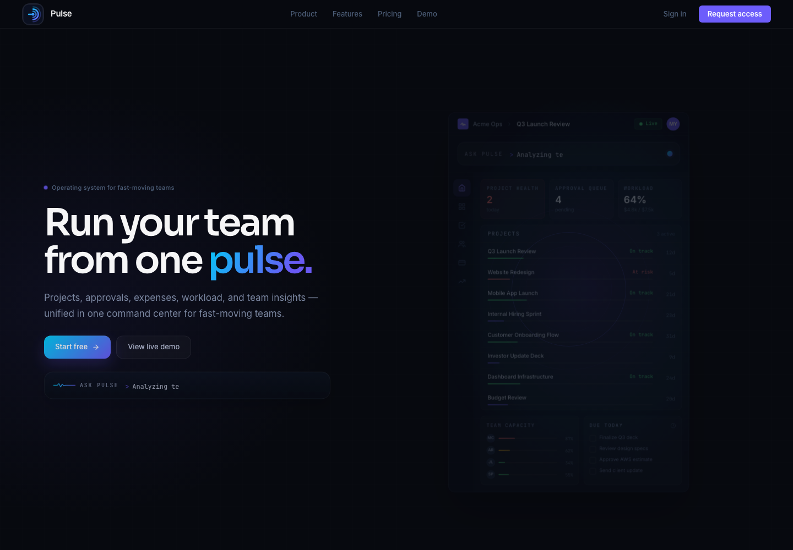
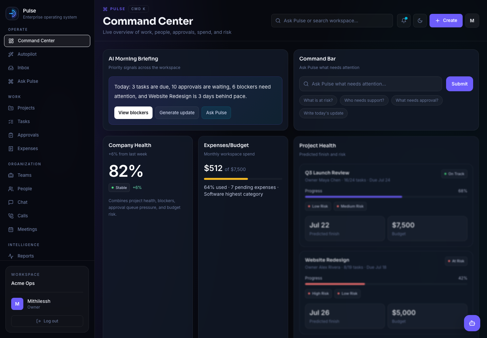
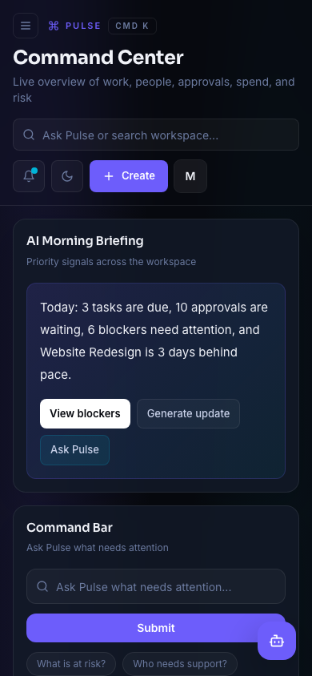
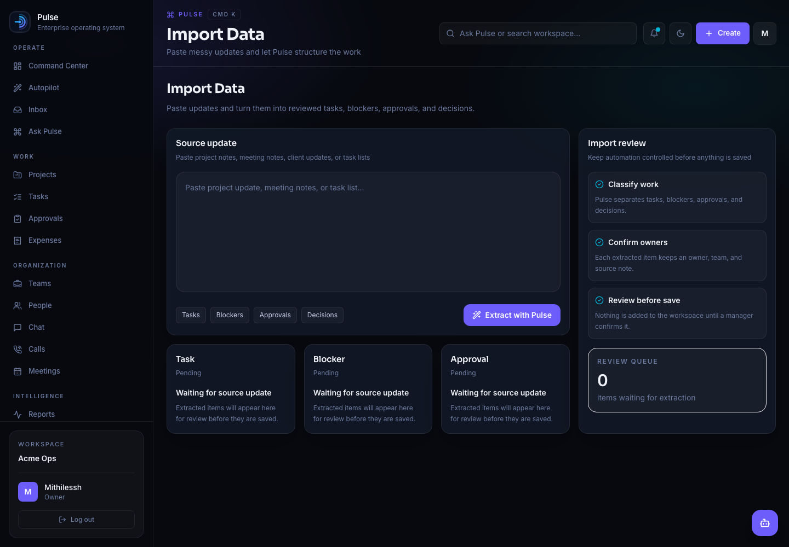
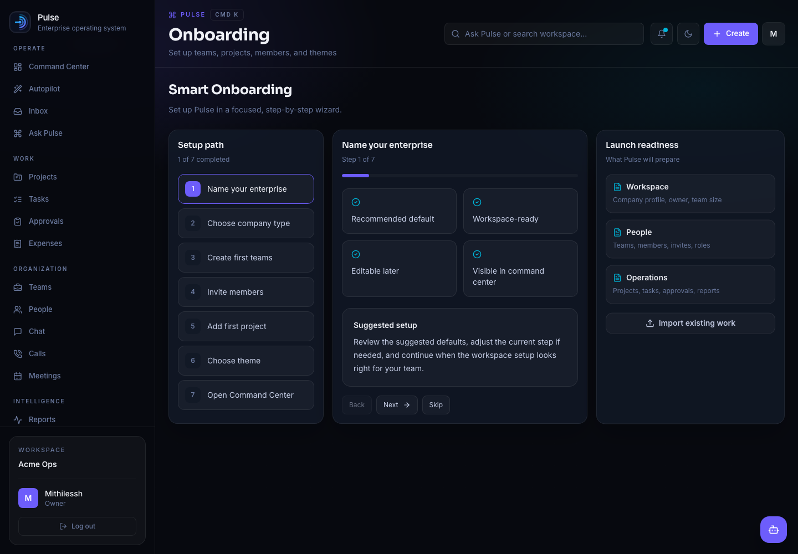

# Pulse

Pulse is an AI team operating system built for the messy middle of work: updates, tasks, approvals, expenses, team activity, meetings, calls, and the little follow-ups that usually get lost between tools.

The idea is simple: instead of making a team jump between ten dashboards, Pulse gives them one command center where they can see what needs attention, ask for help, approve work, and turn scattered context into action.

Claude Web was used to design the websites UI

## Screenshots

### Home

### Command Center

### Mobile App

### Import Flow

### Onboarding

## What It Does

Pulse is designed around the kinds of things a real team checks every day:

- A command center for approvals, blockers, tasks, updates, and team status
- Inbox-style triage for important items that need action
- Task and proof workflows for tracking finished work
- Expense submissions, approvals, exports, and summaries
- AI assistant screens for asking Pulse questions about team activity
- Reports and generated updates for sharing progress
- Meeting, call, chat, team, playbook, and import views
- A polished responsive UI for desktop and mobile

This is still an early product build, but the core app experience is already there.

## Run locally

1. Install dependencies with `npm install`.
2. Copy `.env.local.example` to `.env.local`.
3. Set `JWT_SECRET` to a long random value. Add `MONGODB_URI` to enable account creation and email/password sign-in.
4. Start the app with `npm run dev`, then open `http://localhost:3000`.

The **Try the demo** button on `/signin` does not require MongoDB and is available by
default so the product can be reviewed from a fresh clone. Set
`ENABLE_DEMO_LOGIN=false` to disable it. Real account signup, verification, and sign-in
require MongoDB; email delivery is optional in development because verification codes
are printed in the server console when Resend is not configured.

## License

All rights reserved. See [LICENSE](LICENSE) for details.

No one is allowed to copy, redistribute, host, resell, or claim this work as their own without written permission from the copyright holder.
